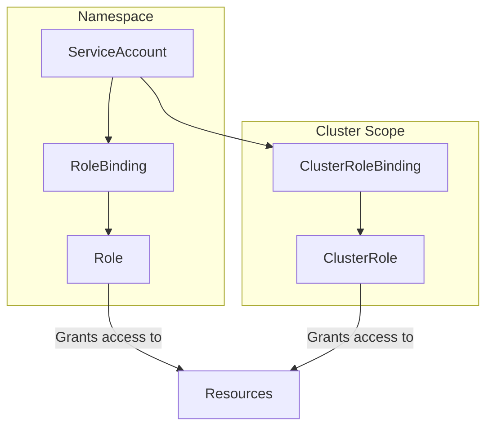
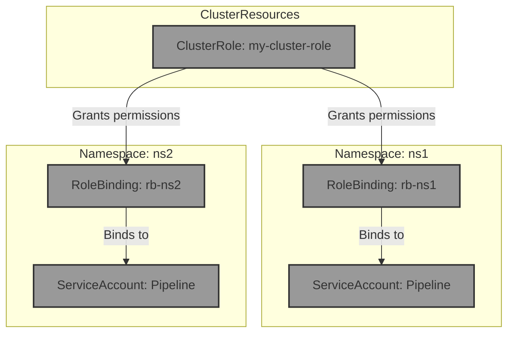

### RBAC - ServiceAccounts.

- 1st part
  - There are existing Namespaces ns1 and ns2 .
  - Create ServiceAccount pipeline in both Namespaces.
  - These SAs should be allowed to view almost everything in the whole cluster. You can use the default ClusterRole view for this.
- 2nd part
  - These SAs should be allowed to create and delete Deployments in their Namespace.
  - Verify everything using kubectl auth can-i.

------------------------------------------------------------------

### Demo

Let's introduce this topic by making a diagram showing how entities work together:


&nbsp;

Having this diagram in mind, and considering that there exist two Namespaces, the more suitable solution would be to create a ClusterRoles that will be binded into two service accounts, one per namespace.




```bash
## YALM output for ClusterRole
k create clusterrole my-cluster-role --resource=deployments --verb=create,delete --dry-run=client -o yaml

## Service Accounts
k create serviceaccount pipeline -n ns1
k create serviceaccount pipeline -n ns2

## Role bindings
k create rolebinding rb-ns1 -n ns1 --clusterrole=my-cluster-role --serviceaccount=ns1:pipeline --namespace=ns1
k create rolebinding rb-ns2 -n ns2 --clusterrole=my-cluster-role --serviceaccount=ns2:pipeline --namespace=ns2

k create clusterrolebinding rb-ns1-view --clusterrole=view --serviceaccount=ns1:pipeline
k create clusterrolebinding rb-ns2-view --clusterrole=view --serviceaccount=ns2:pipeline

```
&nbsp;


my-cluster-role.yaml
```YAML
apiVersion: rbac.authorization.k8s.io/v1
kind: ClusterRole
metadata:
  creationTimestamp: null
  name: my-cluster-role
rules:
- apiGroups:
  - apps
  resources:
  - deployments
  verbs:
  - create
  - delete
- apiGroups:
  - '*'
  resources:
  - '*'
  verbs:
  - list
  - watch
```


```bash
# namespace ns1 deployment manager
k auth can-i delete deployments --as system:serviceaccount:ns1:pipeline -n ns1 # YES
k auth can-i create deployments --as system:serviceaccount:ns1:pipeline -n ns1 # YES
k auth can-i update deployments --as system:serviceaccount:ns1:pipeline -n ns1 # NO
k auth can-i update deployments --as system:serviceaccount:ns1:pipeline -n default # NO

# namespace ns2 deployment manager
k auth can-i delete deployments --as system:serviceaccount:ns2:pipeline -n ns2 # YES
k auth can-i create deployments --as system:serviceaccount:ns2:pipeline -n ns2 # YES
k auth can-i update deployments --as system:serviceaccount:ns2:pipeline -n ns2 # NO
k auth can-i update deployments --as system:serviceaccount:ns2:pipeline -n default # NO

# cluster wide view role
k auth can-i list deployments --as system:serviceaccount:ns1:pipeline -n ns1 # YES
k auth can-i list deployments --as system:serviceaccount:ns1:pipeline -A # YES
k auth can-i list pods --as system:serviceaccount:ns1:pipeline -A # YES
k auth can-i list pods --as system:serviceaccount:ns2:pipeline -A # YES
k auth can-i list secrets --as system:serviceaccount:ns2:pipeline -A # NO (default view-role doesn't allow)
```


