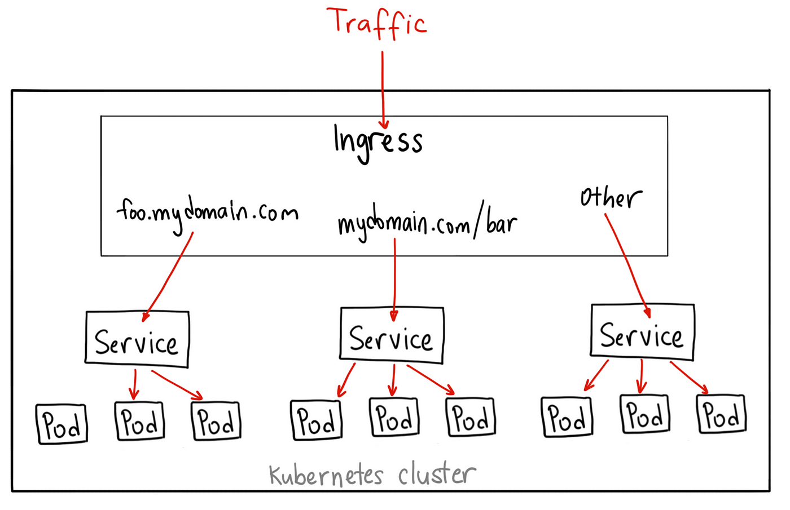

## 11.4 - Troubleshooting access issues

As there has been already review in [Lesson 5 - Networking](https://github.com/AlejandroSobral/CKA/blob/main/Lessons/Lesson%205%20-%20Application%20Access/5.1%20-%20K8s%20Networking/5.1%20-%20K8s%20Networking.md) the way of accesing resources can be resumed as below:

- To access applications running in the Pods, Services and Ingress are used
  - The Ingress resource connects to a Service and picks up its selector label to connect to the backend Pods directly
  - The Service resource uses a selector label to connect to Pods with a matching label

  

    
  

&nbsp;

Not much to review so far.