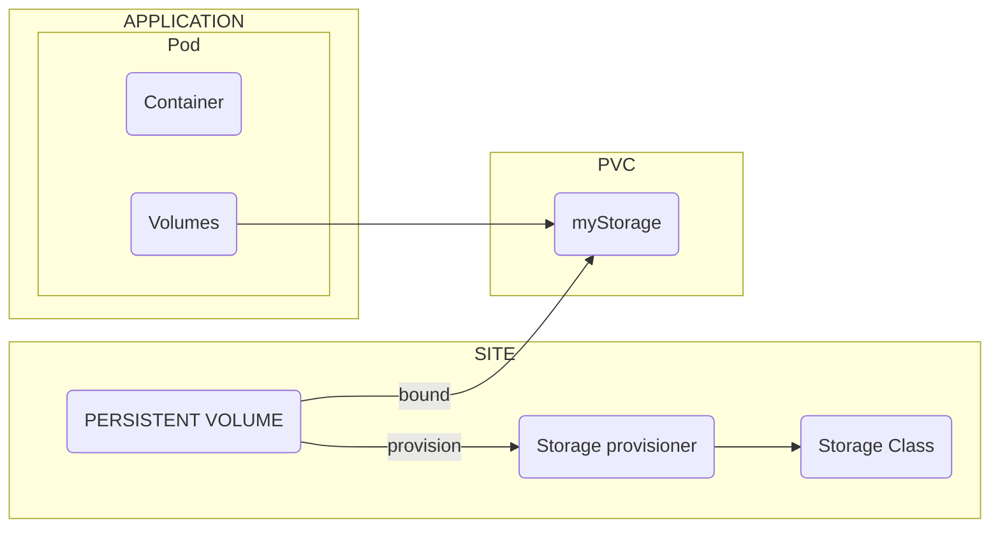

## Lesson 4: Storage

Pod has two parts; containers and volumes. For the sake of decoupling, instead of volume, a PVC (Persistent Volume Claim), which is an independent API resource that will be configured as Pod Volume. Therefore, the Pod will demand for storage, stating the required type, R/W and size.

If the Pods asks for storage, the PVC will check on the site side wheter is any storage is available. In case of matching, it easy and the bound will succeed.

Moreover, there is the flexibility option. It will implement the Storage Class; that will automaticall provision storage should be not available storage at the moment.

The storage class is the API object that represent the Storage Provisioner. Therefore, no matter what storage class is in place, as long as a Storage Provisioner is in place, the storage class can hand out storage on demand.

