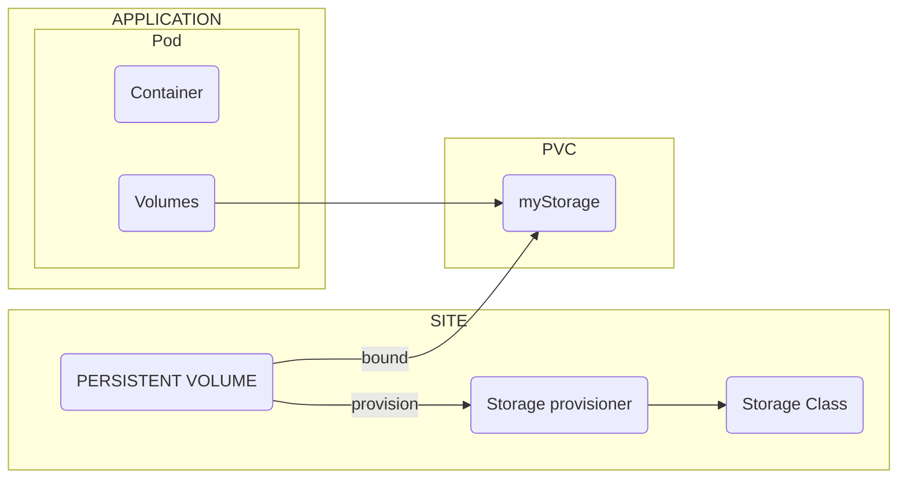

## Lesson 4: Storage

[K8s Volume Docs](https://kubernetes.io/docs/concepts/storage/persistent-volumes/)

--------------------------------------
- <b>Persistent Volume (PV):</b>

An abstraction of storage that can be dynamically bound to a Pod.
Represents a specific piece of storage within the cluster, such as an AWS EBS volume or a local disk.
Can be created manually or dynamically provisioned using Storage Classes.

- <b>Persistent Volume Claim (PVC):</b>

A request by a Pod for a Persistent Volume.
Specifies the desired storage requirements, such as size and access modes.
The Kubernetes system binds a suitable PV to the PVC based on the storage class.

- <b>Storage Class:</b>
  
Defines the characteristics of a storage provisioner, such as the type of storage (e.g., AWS EBS, Azure Disk) and its performance.
Used to dynamically provision Persistent Volumes.
Allows users to choose the appropriate storage type for their workloads.

- <b>Storage Provisioner:</b>
  
The actual implementation that provides the storage.
Responsible for creating and managing Persistent Volumes based on the Storage Class.
Examples include AWS EBS, Azure Disk, and local storage drivers.

- <b> Relationship between these components:</b>

A Storage Class defines the desired characteristics of the storage.
A Storage Provisioner creates a Persistent Volume based on the Storage Class.
A Pod requests a Persistent Volume Claim specifying its storage needs.
The Kubernetes system binds a suitable Persistent Volume to the Persistent Volume Claim.
The Pod can then access the storage through the Volumes mounted within its containers.
This mechanism allows for dynamic storage provisioning and management in Kubernetes, ensuring that applications can access the appropriate storage resources based on their requirements.

--------------------------------------

Pod has two parts; containers and volumes. For the sake of decoupling, instead of volume, a PVC (Persistent Volume Claim), which is an independent API resource that will be configured as Pod Volume. Therefore, the Pod will demand for storage, stating the required type, R/W and size.

If the Pods asks for storage, the PVC will check on the site side wheter is any storage is available. In case of matching, it easy and the bound will succeed.

Moreover, there is the flexibility option. It will implement the Storage Class; that will automaticall provision storage should be not available storage at the moment.

The storage class is the API object that represent the Storage Provisioner. Therefore, no matter what storage class is in place, as long as a Storage Provisioner is in place, the storage class can hand out storage on demand.

