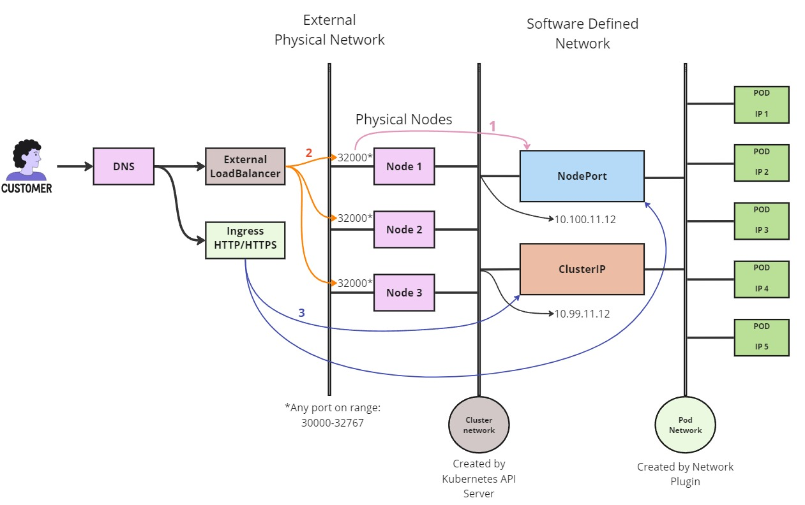

## Kubernetes Ketworking

It happens at different levels, let's say:

- Between containers: implemented as IPC. (Inter-process communication).
- Between Pods: implemented by network plugins. Using a Software Define Network. All Pods are then in the same broadcast domain.
- Between Pods and Services: implemented by Kubernetes Service resources.
- Between external users and Services: implemented by Services, with the help of Ingress.

  

    
  

Diagram explanation:

Physical nodes are wired to a physical network. At external network.
On the other side, behind a NAT (Network Address Translation), there is a SDN (Software-defined Network).
The first SDN is the <b>Cluster Net</b> created by the K8s API server. Second SDN is the <b>Pod Network</b> created by the network plugin.

In order to make the application accesible, there exist the <b>Services.</b>

The <u>default</u> service is a <b>ClusterIP</b>. This default Service type assigns an IP address from a pool of IP addresses that your cluster has reserved for that purpose. and so is not reachable from outside.

To have one outside-reachable, you can configure a <b>NodePort</b>. Simply, is a port-forwarding and load-balacing the Pods.

In practical enviroment, a customer would access a LoadBalancer which would set the request to the NodePort.

The second option would be a [Ingress](https://kubernetes.io/docs/concepts/services-networking/ingress/) which works for HTTP/HTTPS traffic only.

Ingress exposes HTTP and HTTPS routes from outside the cluster to services within the cluster (Either NodePort or ClusterIP). Traffic routing is controlled by rules defined on the Ingress resource.