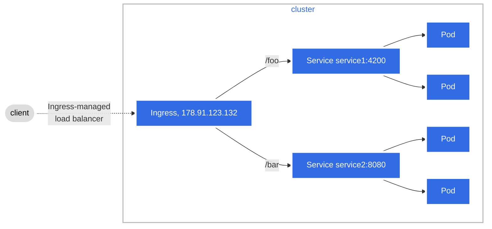

## Ingress configuration

Ingress configuration is about rules. They will catch the incoming traffic that matches a specific path and optional host name and connects to a service and port.



Different paths can be defined on the same host:

```bash
kubectl create ingress myingress --rule="/myingress=myingress:80" --rule="/youringress=youringress:80
```

But also, different virtual hosts on the same server can be defined. "Name based virtual hosts" as they are known.

```bash
kubectl create ingress nginxsvc --class=nginx --rule="nginxsvc.info/=nginxsvc:80" --rule="otherserver.org/=otherserver:80"
```

## Ingress controllers

Ingresses can be implemented by different controllers, often with different configuration. Each Ingress should specify a class, a reference to an IngressClass resource that contains additional configuration including the name of the controller that should implement the class.

While defining Ingress rules, the --class option should be used to implement the role on a specific Ingress controller.

You can mark a particular IngressClass as default for your cluster. Setting the ingressclass.kubernetes.io/is-default-class annotation to true on an IngressClass resource will ensure that new Ingresses without an ingressClassName field specified will be assigned this default IngressClass

Check the existing IngressClass:

``` bash
kubectl get ingressclass
NAME    CONTROLLER             PARAMETERS   AGE
nginx   k8s.io/ingress-nginx   <none>       2d
``` 

As an example, if the content of the IngressClass can be checked to verify that no default class is set:
``` bash
kubectl get ingressclass -o yaml
```

``` bash
apiVersion: v1
items:
- apiVersion: networking.k8s.io/v1
  kind: IngressClass
  metadata:
    annotations:
      meta.helm.sh/release-name: ingress-nginx
      meta.helm.sh/release-namespace: ingress-nginx
    creationTimestamp: "2024-12-06T22:41:36Z"
    generation: 1
    labels:
      app.kubernetes.io/component: controller
      app.kubernetes.io/instance: ingress-nginx
      app.kubernetes.io/managed-by: Helm
      app.kubernetes.io/name: ingress-nginx
      app.kubernetes.io/part-of: ingress-nginx
      app.kubernetes.io/version: 1.11.3
      helm.sh/chart: ingress-nginx-4.11.3
    name: nginx
    resourceVersion: "67375"
    uid: 5d232067-afc4-43a0-9c94-ba3de9549bba
  spec:
    controller: k8s.io/ingress-nginx
kind: List
metadata:
  resourceVersion: ""
```
To set the default-class, following command should be used:

```bash
kubectl edit ingressclass nginx
```

Add this line after metada.annotations:
``` js
ingressclass.kubernetes.io/is-default-class: "true"
```
It will finally look like:

```bash
apiVersion: v1
items:
- apiVersion: networking.k8s.io/v1
  kind: IngressClass
  metadata:
    annotations:
      ingressclass.kubernetes.io/is-default-class: "true"
      meta.helm.sh/release-name: ingress-nginx
      meta.helm.sh/release-namespace: ingress-nginx
    creationTimestamp: "2024-12-06T22:41:36Z"
    generation: 1
    labels:
      app.kubernetes.io/component: controller
      app.kubernetes.io/instance: ingress-nginx
      app.kubernetes.io/managed-by: Helm
      app.kubernetes.io/name: ingress-nginx
      app.kubernetes.io/part-of: ingress-nginx
      app.kubernetes.io/version: 1.11.3
      helm.sh/chart: ingress-nginx-4.11.3
    name: nginx
    resourceVersion: "86066"
    uid: 5d232067-afc4-43a0-9c94-ba3de9549bba
  spec:
    controller: k8s.io/ingress-nginx
kind: List
metadata:
  resourceVersion: ""
```