## High Availability

In order to meet the minium requirements according to [Kubernetes documentation](https://kubernetes.io/docs/setup/production-environment/tools/kubeadm/high-availability/):

```bash
"Three or more machines that meet kubeadm's minimum requirements for the control-plane nodes. Having an odd number of control plane nodes can help with leader selection in the case of machine or zone failure"
```

I'll make a bet and try using [Linux Talos](https://www.talos.dev/), a Linux designed for Kubernetes.

Therefore I hope to be able to meet the HA requirements easier by setting the nodes at a virtualized [ProxMox](https://www.proxmox.com/en/), a open-source virtualization tool.

To make my way to HA smoother, I'll set two steps. First will mean creating a K8s cluster with no defined topology using the new toolset, and the second will mean creating a pre-defined HA topology. There we go.

-------------------------------
### Pre-steps

Since I'm working in a Virtualized invornment, running on Oracle VirtualBox, there exist many configurations that worth mentioning. Should this not be your case, just skip this.

First step will involve creating the VM in VirtualBox, by clicking "New".

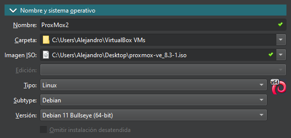

Before starting it, change the network configuration:

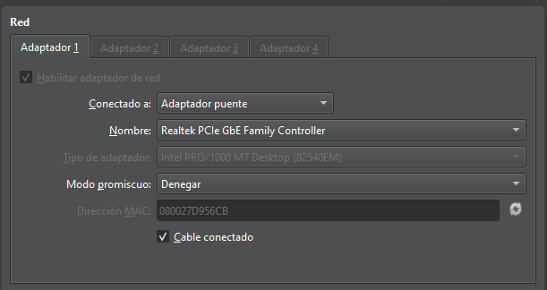


- Hey, I've been using English so far since I started using computers. Should you be an english speaker, well.. do as I have done and put some effort in understanding the spanish of this pictures.

Before starting the VM, be aware that this flag should be set ON:

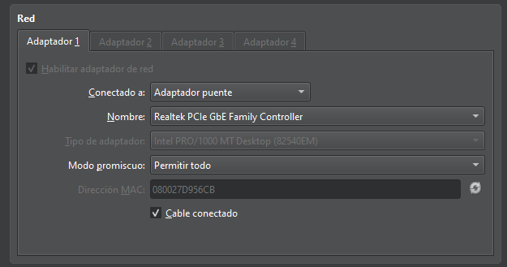
If for any reason, that keeps enable to be set, try using the following as workaround:

```bash
C:\Users\Alejandro\VirtualBox VMs\ProxMox>"C:\Program Files\Oracle\VirtualBox\VBoxManage.exe" modifyvm "ProxMox" --nested-hw-virt on
```
&nbsp;

Just after this, start the ProxMox. It will prompt the installation guide. No further details to consider during the installation. May be, except, the fact that if the wizard suggest using an IP like 10.xx.xxx.xx, there is some issue with the Network configuration.

Once is done, and before rebooting, delete the optical source. Therefore, it will start using the virtual device as to boot:

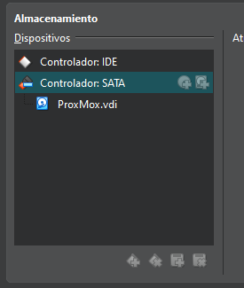

After booting, it will prompt a message similar to the following:


Now that the ProxMox is set, you can proceed with the following title.

-------------------------------
### First approach

At this first approach, I'll run a Kubernetes Cluster with some Nodes in order to get familiar with the new working environmenmt. I'll not deploy any particular topology, just couple of working nodes and a control-plane.

You can follow [this guide for setup ProxMox in Oracle Virtual Box.](https://www.talos.dev/v1.9/talos-guides/install/virtualized-platforms/proxmox/)

<details>
<summary> Talos on ProxMox My own version of the guide </summary>

First of all, setup the Talos ISO in ProxMox:

Open the ProxMox shell and browse to:
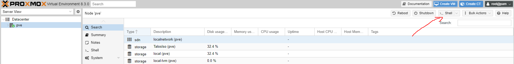

```bash
cd /var/lib/vz/template/iso
```

At this path, ProxMox is looking for ISOs to create new VMs.

So, let's try by downloading some Talos release ISOs straight from GitHub:
```bash
curl https://github.com/siderolabs/talos/releases/download/v1.7.5/metal-amd64.iso -L -o talos.iso
```
&nbsp;

This will be the expected output:
```bash
root@pve:~# pwd
/root
root@pve:~# cd /var/lib/vz/template/iso
root@pve:/var/lib/vz/template/iso# pwd
/var/lib/vz/template/iso
root@pve:/var/lib/vz/template/iso# curl https://github.com/siderolabs/talos/releases/download/v1.7.5/metal-amd64.iso -L -o talos.iso
  % Total    % Received % Xferd  Average Speed   Time    Time     Time  Current
                                 Dload  Upload   Total   Spent    Left  Speed
  0     0    0     0    0     0      0      0 --:--:--  0:00:01 --:--:--     0
100 89.0M  100 89.0M    0     0  24.8M      0  0:00:03  0:00:03 --:--:-- 63.0M
root@pve:/var/lib/vz/template/iso#
```


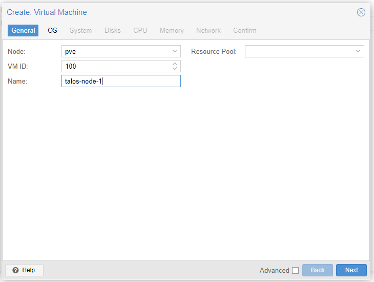

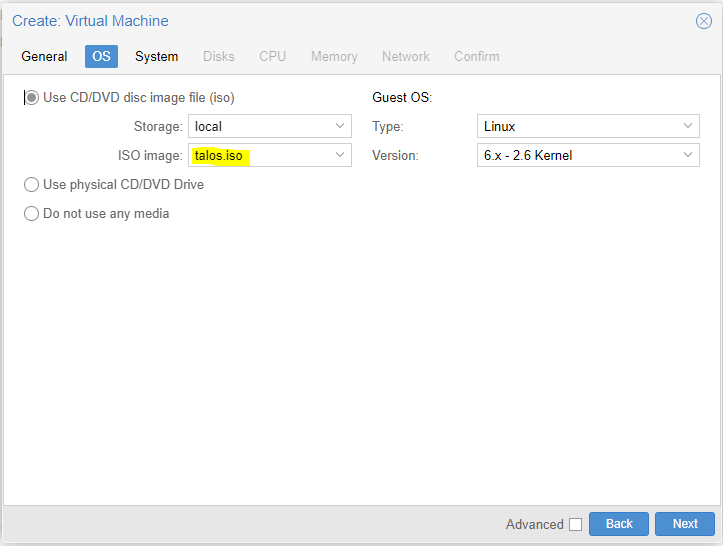

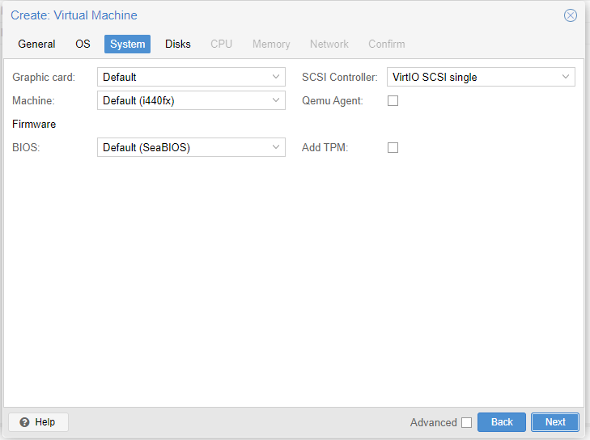


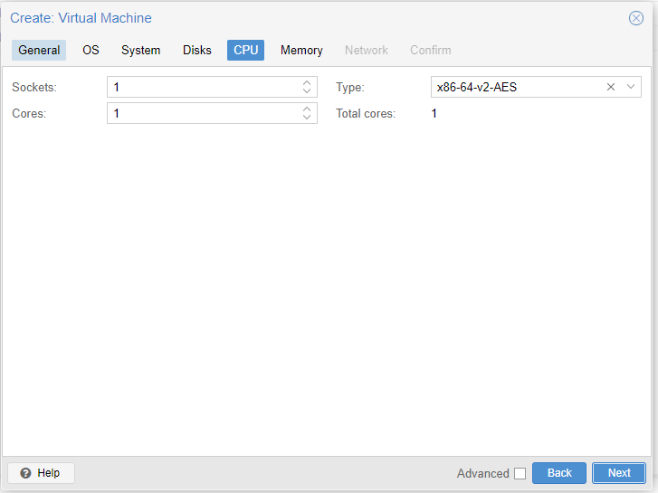

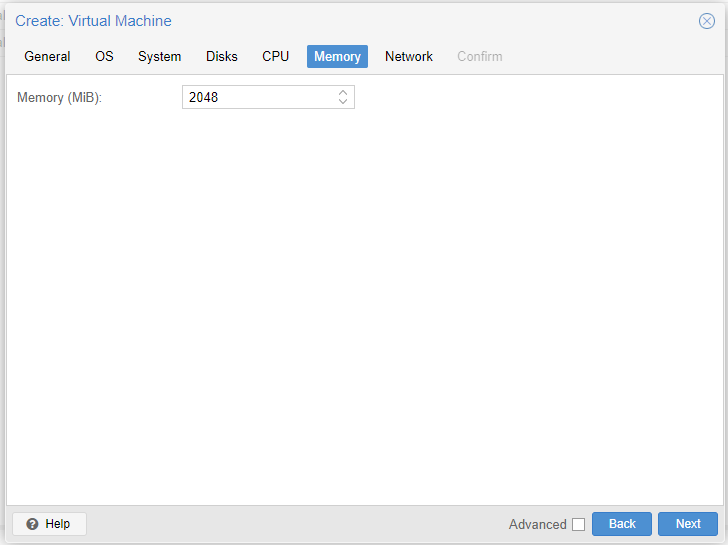

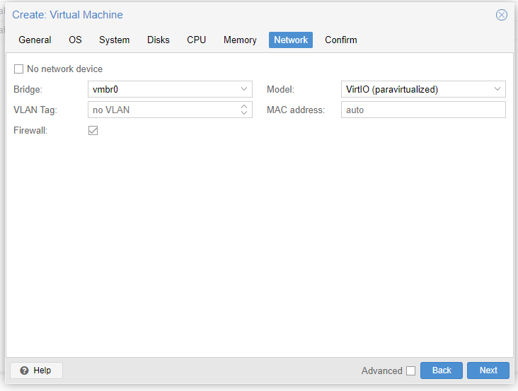

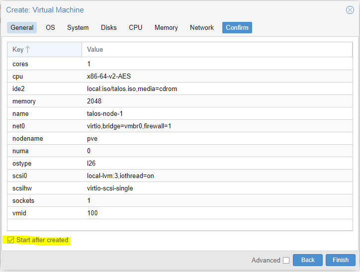

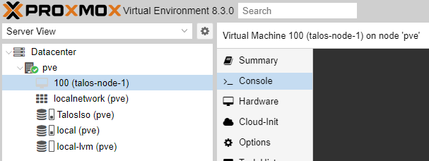

<b> Just in case KVM virtualization is failing</b>:


Toggle this flag and try again. Best wishes!.

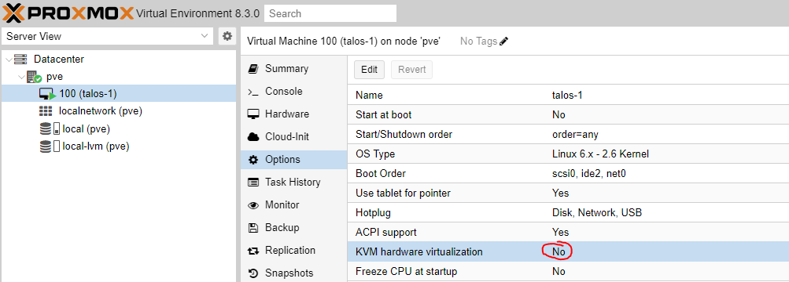

</details>

Once the VirtualBox setup is done, proceed with the [Setup of the Node itself guide.](https://www.talos.dev/v1.9/talos-guides/install/virtualized-platforms/proxmox/#generate-machine-configurations)

Once more, adding my own below:

Setup env variable with the node IP:
```bash
export CONTROL_PLANE_IP=192.168.1.26
```


Generate machine configurations:
```bash
talosctl gen config talos-proxmox-cluster https://$CONTROL_PLANE_IP:6443 --output-dir _out
```

```bash
talosctl get disks --insecure --nodes $CONTROL_PLANE_IP
```

---------------------------------

EL PROXIMO COMANDO NO ANDA!!

----------------------------------

```bash
talosctl apply-config --insecure --nodes $CONTROL_PLANE_IP --file _out/controlplane.yaml
```

```bash
export WORKER_IP=192.168.1.27
```

```bash
talosctl apply-config --insecure --nodes $WORKER_IP2 --file _out/worker.yaml
```

```bash
export TALOSCONFIG="_out/talosconfig"

talosctl config endpoint $CONTROL_PLANE_IP

talosctl config node $CONTROL_PLANE_IP

```
```bash
alesb@ControlNode:~/Desktop/Talos$ talosctl apply-config --insecure --nodes $CONTROL_PLANE_IP --file _out/controlplane.yaml
alesb@ControlNode:~/Desktop/Talos$ export TALOSCONFIG="_out/talosconfig"
alesb@ControlNode:~/Desktop/Talos$ talosctl config endpoint $CONTROL_PLANE_IP
alesb@ControlNode:~/Desktop/Talos$ talosctl config node $CONTROL_PLANE_IP
alesb@ControlNode:~/Desktop/Talos$ talosctl bootstrap
alesb@ControlNode:~/Desktop/Talos$ talosctl kubeconfig .
kubectl get nodes --kubeconfig=kubeconfig

```

talosctl kubeconfig --nodes $CONTROL_PLANE_IP --endpoints $CONTROL_PLANE_IP --talosconfig=./talosconfig

=============================


FRESH START

export CONTROL_PLANE_IP=192.168.1.30
talosctl gen config talos-proxmox-cluster https://$CONTROL_PLANE_IP:6443 --output-dir _out
talosctl get disks --insecure --nodes $CONTROL_PLANE_IP
talosctl apply-config --insecure --nodes $CONTROL_PLANE_IP --file _out/controlplane.yaml

export TALOSCONFIG="_out/talosconfig"
talosctl config endpoint $CONTROL_PLANE_IP
talosctl config node $CONTROL_PLANE_IP


talosctl containers -k

talosctl bootstrap

talosctl kubeconfig .

