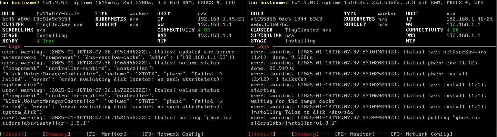

- [Introduction](#introduction)
- [High Availability](#high-availability)
  - [Environment setup](#environment-setup)
  - [First Cluster](#first-cluster)
  - [HA - High Availability cluster](#ha---high-availability-cluster)

## Introduction

This readme tends to guide the path towards achieving a milestone: Run a High Availability Kubernetes Cluster locally. Using few resources and getting in touch with the underlying infrastructre. This is rare since most of the times, in production environments, the Cloud-Provider load this type of burden. Enjoy.

## High Availability

In order to meet the minium requirements according to [Kubernetes documentation](https://kubernetes.io/docs/setup/production-environment/tools/kubeadm/high-availability/):

```bash
"Three or more machines that meet kubeadm's minimum requirements for the control-plane nodes. Having an odd number of control plane nodes can help with leader selection in the case of machine or zone failure"
```

I'll make a bet and try using [Linux Talos](https://www.talos.dev/), a Linux designed for Kubernetes.

Therefore I hope to be able to meet the HA requirements easier by setting the nodes at a virtualized using VirtualBox VM machines.

To make my way to HA smoother, I'll set two steps. First will mean creating a K8s cluster with no defined topology using the new toolset, and the second will mean creating a pre-defined HA topology. There we go.


-------------------------------
### Environment setup

Since I'm working in a Virtualized invornment, running on Oracle VirtualBox, there exist many configurations that worth mentioning. Should this not be your case, just skip this.

First step will involve creating the VM in VirtualBox, by clicking "New".


Select the Talos ISO and set the Type/Subtype/Version:


Set the hardware to meet the [minimum requirements](https://www.talos.dev/v1.9/introduction/system-requirements/):


Before starting the node, change the network configuration:


-------------------------------

### First Cluster

At this first approach, I'll run a Kubernetes Cluster with some Nodes in order to get familiar with the new working environmenmt. I'll not deploy any particular topology, just couple of working nodes and a control-plane.

To achive this, first create three Talos Nodes:


After starting the nodes, both will look like the following:


Nodes are waiting to get some configuration. Since this OS have a Read-Only file-system, the only way to configure and interact with the nodes, it using the API.

There we go. Start by installing [checking this guide](https://www.talos.dev/v1.9/introduction/getting-started/#talosctl).

Set the IPs for the components. (Check the nodes IP at the GUI).

```bash
export CONTROL_PLANE_NODE=192.168.1.44
export WORKER_NODE_1=192.168.1.45
export WORKER_NODE_2=192.168.1.46
```


Generate the files that will be applied via API to the nodes:
```bash
talosctl gen config TinyCluster https://$CONTROL_PLANE_NODE:6443 --output-dir _out 
```

```bash
alesb@LightUbuntu:~/Desktop/Tiny-Talos$ talosctl gen config TinyCluster https://$CONTROL_PLANE_NODE:6443 --output-dir _out
generating PKI and tokens
Created _out/controlplane.yaml
Created _out/worker.yaml
Created _out/talosconfig
alesb@LightUbuntu:~/Desktop/Tiny-Talos$ ls
_out
```

Before applying the configuration to the Control Node, check the output of its GUI. It should be "quiet" with no new output flowing.

Apply the cfg to the control-node:
```bash
talosctl apply-config --insecure --nodes $CONTROL_PLANE_NODE --file _out/controlplane.yaml
```
It will prompt the installation into the node:


Once the installation finishes:


It is time now to configure the talosctl endpoint:

```bash
talosctl config endpoint $CONTROL_PLANE_NODE
talosctl config node $CONTROL_PLANE_NODE
```

Check it has been setup properly:
```bash
alesb@LightUbuntu:~/Desktop/Tiny-Talos$ cat _out/talosconfig
context: TinyCluster
contexts:
    TinyCluster:
        endpoints:
            - 192.168.1.44
        nodes:
            - 192.168.1.44
```

Now export the talos config:
```bash
export TALOSCONFIG="_out/talosconfig"
```

Start the etcd process in the control node:

```bash
talosctl bootstrap --nodes $CONTROL_PLANE_NODE
```


Test the current status by doing:

```bash
talosctl containers -k --nodes $CONTROL_PLANE_NODE
NODE           NAMESPACE   ID                                                                                          IMAGE                                             PID    STATUS
192.168.1.44   k8s.io      kube-system/kube-apiserver-talos-a0l-qtk                                                    registry.k8s.io/pause:3.10                        2364   SANDBOX_READY
192.168.1.44   k8s.io      └─ kube-system/kube-apiserver-talos-a0l-qtk:kube-apiserver:79abd7d76e39                     registry.k8s.io/kube-apiserver:v1.32.0            2491   CONTAINER_RUNNING
192.168.1.44   k8s.io      kube-system/kube-controller-manager-talos-a0l-qtk                                           registry.k8s.io/pause:3.10                        2395   SANDBOX_READY
192.168.1.44   k8s.io      └─ kube-system/kube-controller-manager-talos-a0l-qtk:kube-controller-manager:479a72393885   registry.k8s.io/kube-controller-manager:v1.32.0   2444   CONTAINER_RUNNING
192.168.1.44   k8s.io      kube-system/kube-scheduler-talos-a0l-qtk                                                    registry.k8s.io/pause:3.10                        2405   SANDBOX_READY
192.168.1.44   k8s.io      └─ kube-system/kube-scheduler-talos-a0l-qtk:kube-scheduler:a2eb6f239d89                     registry.k8s.io/kube-scheduler:v1.32.0 
```

It is now time to setup the worker nodes. Now again, check the status of the output logs before proceeding. It will start flowing once the config is applied:

```bash
export WORKER_IP_1=192.168.1.45
export WORKER_IP_2=192.168.1.46
```

```bash
talosctl apply-config --insecure --nodes $WORKER_NODE_1 --file _out/worker.yaml
talosctl apply-config --insecure --nodes $WORKER_NODE_2 --file _out/worker.yaml
```




Check the machines # that is available at all nodes once the installation finishes.


Once all the installations are down, remove the iso from the booting point and reboot three nodes:


Create the Kubeconfig so as to be able to manage the Cluster, based on the talosconfig:

```bash
talosctl kubeconfig . --talosconfig _out/talosconfig
```

```bash
alesb@LightUbuntu:~/Desktop/Tiny-Talos$ talosctl kubeconfig . --talosconfig _out/talosconfig
alesb@LightUbuntu:~/Desktop/Tiny-Talos$ ls
kubeconfig  _out
```

&nbsp;

<details> 
<summary>What if kubectl is not configured correctly?</summary>

```bash
alesb@LightUbuntu:~/Desktop/Tiny-Talos$ kubectl get nodes
E0118 15:11:18.166894   32303 memcache.go:265] "Unhandled Error" err="couldn't get current server API group list: Get \"https://127.0.0.1:39419/api?timeout=32s\": dial tcp 127.0.0.1:39419: connect: connection refused"
E0118 15:11:18.169197   32303 memcache.go:265] "Unhandled Error" err="couldn't get current server API group list: Get \"https://127.0.0.1:39419/api?timeout=32s\": dial tcp 127.0.0.1:39419: connect: connection refused"
E0118 15:11:18.171618   32303 memcache.go:265] "Unhandled Error" err="couldn't get current server API group list: Get \"https://127.0.0.1:39419/api?timeout=32s\": dial tcp 127.0.0.1:39419: connect: connection refused"
E0118 15:11:18.174195   32303 memcache.go:265] "Unhandled Error" err="couldn't get current server API group list: Get \"https://127.0.0.1:39419/api?timeout=32s\": dial tcp 127.0.0.1:39419: connect: connection refused"
E0118 15:11:18.176539   32303 memcache.go:265] "Unhandled Error" err="couldn't get current server API group list: Get \"https://127.0.0.1:39419/api?timeout=32s\": dial tcp 127.0.0.1:39419: connect: connection refused"
The connection to the server 127.0.0.1:39419 was refused - did you specify the right host or port?
```
</details>

Configure kubectl:

```bash
export KUBECONFIG=./kubeconfig
```

Check the output:

```bash
alesb@LightUbuntu:~/Desktop/Tiny-Talos$ kubectl get nodes
NAME            STATUS   ROLES           AGE     VERSION
talos-08p-q0z   Ready    <none>          9m27s   v1.32.0
talos-a0l-qtk   Ready    control-plane   13m     v1.32.0
talos-s54-bn9   Ready    <none>          9m28s   v1.32.0
```

Should be the case, that the worker node didn't get its role automatically, set it up by doing:
```bash
kubectl label node talos-08p-q0z  node-role.kubernetes.io/worker=worker
kubectl label node talos-s54-bn9  node-role.kubernetes.io/worker=worker
```

```bash
NAME            STATUS   ROLES           AGE   VERSION
talos-08p-q0z   Ready    worker          20m   v1.32.0
talos-a0l-qtk   Ready    control-plane   23m   v1.32.0
talos-s54-bn9   Ready    worker          20m   v1.32.0
```

Now create a deployment:
```bash
kubectl create deployment tinytalos --image=nginx --replicas=4
```

There it is! A working Cluster :)

```bash
NAME                          READY   STATUS    RESTARTS   AGE   IP           NODE            NOMINATED NODE   READINESS GATES
tinytalos-54d7f47d68-2hg66   1/1     Running   0          17s   10.244.2.3   talos-08p-q0z   <none>           <none>
tinytalos-54d7f47d68-6scvs   1/1     Running   0          17s   10.244.1.2   talos-s54-bn9   <none>           <none>
tinytalos-54d7f47d68-dkmvk   1/1     Running   0          17s   10.244.2.2   talos-08p-q0z   <none>           <none>
tinytalos-54d7f47d68-kbjng   1/1     Running   0          17s   10.244.1.3   talos-s54-bn9   <none>           <none>
```

-----------------------------------------

### HA - High Availability cluster

If you have skipped the implementation of the [First Cluster](#first-cluster), you might miss some details. I'd recommend to get it through first. The setup will be similar than the previous one in terms of resources, networking, etc.

To achieve the high availabilty, it will be necessary to setup a Virtual IP (VIP) Address and use the automatic load-balance feature that [Talos](https://www.talos.dev/v1.9/talos-guides/network/vip/) have.

"To simplify cluster creation, Talos Linux supports a “Virtual” IP (VIP) address to access the Kubernetes API server, providing high availability with no other resources required."

Let's review the plan to make it work in our humble 'On-prem' machine:

Get the IPs from the GUIs and select a available IP from the pool to set the VIP:
```bash
export CONTROL_PLANE_NODES_1=192.168.1.36
export CONTROL_PLANE_NODES_2=192.168.1.37
export CONTROL_PLANE_NODES_3=192.168.1.39
export VIP=192.168.1.50
```

Generate the files to interact with the cluster:
```bash
talosctl gen config MyHaCluster https://$VIP:6443 --output-dir _out 
```

Edit the controplane.yaml and include the following:

At machine.network

```YAML
network:
     interfaces:
      - interface: enp0s3 # This came from default Talos iso
        dhcp: true
        vip:
          ip: 192.168.1.50
```


Now apply the configuration to each control plane node:
```bash
talosctl apply-config --insecure --nodes $CONTROL_PLANE_NODES_1 --file _out/controlplane.yaml
talosctl apply-config --insecure --nodes $CONTROL_PLANE_NODES_2 --file _out/controlplane.yaml
talosctl apply-config --insecure --nodes $CONTROL_PLANE_NODES_3 --file _out/controlplane.yaml
```
The control nodes will start booting, the same as it happened in the previous tutorial:

Set the talosconfig file:
```bash
export TALOSCONFIG="_out/talosconfig"
```


Configure the talosconfig file, but pointing at one node. This will help to boot etcd:
```bash
talosctl config endpoint $CONTROL_PLANE_NODES_1
talosctl config node $CONTROL_PLANE_NODES_1
```

The file will look as below:
```YAML
context: MyHaCluster
contexts:
    MyHaCluster:
        endpoints:
            - 192.168.1.36
        nodes:
            - 192.168.1.36
```


Bootstrap the etcd service:
talosctl bootstrap --nodes $CONTROL_PLANE_NODES_1

The VIP will appear in that node as secondary IP:


At this point, this commands should work properly:
```bash
talosctl containers -k --nodes $CONTROL_PLANE_NODES_1
talosctl containers -k --nodes $CONTROL_PLANE_NODES_2
talosctl containers -k --nodes $CONTROL_PLANE_NODES_2
```

Time to set the endpoint to the VIP, now that is working:
```bash
talosctl config endpoint $VIP
```

File will look like:
```YAML
context: MyHaCluster
contexts:
    MyHaCluster:
        endpoints:
            - 192.168.1.50
        nodes:
            - 192.168.1.36
```

Let's generate the kubeconfig file, with the VIP configure:

```bash
talosctl kubeconfig . --endpoints $VIP --talosconfig _out/talosconfig
```

```bash
export KUBECONFIG=./kubeconfig
```

Let's check for the existing nodes:
```bash
alesb-debian@Debian:~/Desktop/Talos/HA-Talos$ kubectl get nodes
NAME            STATUS   ROLES           AGE     VERSION
talos-9oq-d9y   Ready    control-plane   5m38s   v1.32.0
talos-boo-0w9   Ready    control-plane   67s     v1.32.0
talos-uaz-u6w   Ready    control-plane   6m9s    v1.32.0
```

It is now high time to set the workers:

```bash
export WORKER_IP_1=192.168.1.38
export WORKER_IP_2=192.168.1.40
```

Execute the following:
```bash
talosctl apply-config --insecure --nodes $WORKER_IP_1 --file _out/worker.yaml
talosctl apply-config --insecure --nodes $WORKER_IP_2 --file _out/worker.yaml
```

Now again, it will take some minutes and prompt many lines in the worker GUI.

Label the worker nodes to have it nice & tidy:

```bash
kubectl label node talos-3fz-yx9  node-role.kubernetes.io/worker=worker
kubectl label node talos-gw2-5ux  node-role.kubernetes.io/worker=worker
```

```bash
alesb-debian@Debian:~/Desktop/Talos/HA-Talos$ kubectl get nodes
NAME            STATUS   ROLES           AGE     VERSION
talos-gw2-5ux   Ready    worker          74s     v1.32.0
talos-3fz-yx9   Ready    worker          72s     v1.32.0
talos-9oq-d9y   Ready    control-plane   10m     v1.32.0
talos-boo-0w9   Ready    control-plane   6m16s   v1.32.0
talos-uaz-u6w   Ready    control-plane   11m     v1.32.0
```

Let's create a little deployment:

```bash
kubectl create deployment ha-talos --image=nginx --replicas=6
```

And check its distribution among the Pods:

```bash
NAME                        READY   STATUS    RESTARTS      AGE     IP            NODE            NOMINATED NODE   READINESS GATES
ha-talos-7454d6dfcb-k7ppl   1/1     Running   1 (32s ago)   4m24s   10.244.3.19   talos-gw2-5ux   <none>           <none>
ha-talos-7454d6dfcb-nhvtn   1/1     Running   0             17s     10.244.4.4    talos-3fz-yx9   <none>           <none>
ha-talos-7454d6dfcb-pnnn7   1/1     Running   0             16s     10.244.4.3    talos-3fz-yx9   <none>           <none>
ha-talos-7454d6dfcb-wrk4n   1/1     Running   0             16s     10.244.3.17   talos-gw2-5ux   <none>           <none>
ha-talos-7454d6dfcb-wwvwv   1/1     Running   0             16s     10.244.4.2    talos-3fz-yx9   <none>           <none>
ha-talos-7454d6dfcb-z8gsj   1/1     Running   0             16s     10.244.3.18   talos-gw2-5ux   <none>           <none>
```

Now is time to test the High-avalability. For that, I'll isolate any control-node and check the behaviour.

I'll start for the control-node 1, which has holding the VIP. To begin with, I'll simulate a network issue. Equivalent to cut the network wire:


The control-node "talos-9oq-d9y" is now out of service, but the "kubectl get nodes" still works. How?
```bash
NAME            STATUS     ROLES           AGE   VERSION
talos-3fz-yx9   Ready      worker          18m   v1.32.0
talos-9oq-d9y   NotReady   control-plane   27m   v1.32.0
talos-boo-0w9   Ready      control-plane   23m   v1.32.0
talos-gw2-5ux   Ready      worker          18m   v1.32.0
talos-uaz-u6w   Ready      control-plane   28m   v1.32.0
```

The VIP has been automatically transfered to other control-node, within the minute:


To reinforce this idea, let's check the Pods:

```bash
NAME                        READY   STATUS    RESTARTS        AGE   IP            NODE            NOMINATED NODE   READINESS GATES
ha-talos-7454d6dfcb-k7ppl   1/1     Running   2 (5m15s ago)   14m   10.244.3.22   talos-gw2-5ux   <none>           <none>
ha-talos-7454d6dfcb-pnnn7   1/1     Running   1 (5m19s ago)   10m   10.244.4.5    talos-3fz-yx9   <none>           <none>
ha-talos-7454d6dfcb-wrk4n   1/1     Running   1 (5m15s ago)   10m   10.244.3.21   talos-gw2-5ux   <none>           <none>
ha-talos-7454d6dfcb-z8gsj   1/1     Running   1 (5m15s ago)   10m   10.244.3.20   talos-gw2-5ux   <none>           <none>
```

I'll now re-plug the wire and attack other control-node. This time I'll simulate a hardware failure:


As expected, the node become NotReady. But the Cluster kept working.

<b>Welcome to High Availability!</b>

```bash
NAME            STATUS     ROLES           AGE   VERSION
talos-3fz-yx9   Ready      worker          27m   v1.32.0
talos-9oq-d9y   NotReady   control-plane   36m   v1.32.0
talos-boo-0w9   Ready      control-plane   32m   v1.32.0
talos-gw2-5ux   Ready      worker          27m   v1.32.0
talos-uaz-u6w   Ready      control-plane   37m   v1.32.0
```