## 8.7 - Lab

This lab is about configuring taints. Let's create a taint on some node worker, that does not allow new Pods to be scheduled that do not have generic tolerations.

--------------------------------

## Objective

In a 2 worker nodes ambience, one of them will be tainted. Therefore, two deployments will be created. Square deployment will have no tolerations whereas the triangle will have the tolerations set. Let's see the result.

## Diagram

```mermaid
graph TD;
    subgraph "Node 1 (Tainted)"
        A["🟦 Pod 1 (No Toleration)"]
        B["🟦 Pod 2 (No Toleration)"]
        C["🔺 Pod 3 (With Toleration)"]
    end

    subgraph "Node 2 (No Taint)"
        D["🔺 Pod 4 (With Toleration)"]
    end
```



--------------------------------

### Demo

Set the taint on the node "1".
```bash
kubectl taint nodes talos-2pv-ytc GenericKey=GenericTaint:NoSchedule
node/talos-2pv-ytc tainted
```
&nbsp;

Verify the taint for the node:
```bash
kubectl describe node talos-2pv-ytc | grep Taint
Taints:             GenericKey=GenericTaint:NoSchedule
```

&nbsp;

Now create the deployments. First the "triangle-toleration" one:

```bash
kubectl apply -f triangle-toleration-deployment.yaml
deployment.apps/triangle-toleration-deployment created
```

&nbsp;

triangle-toleration-deployment.yaml:
```YAML
apiVersion: apps/v1
kind: Deployment
metadata:
  name: triangle-toleration-deployment
  labels:
    app: my-app
spec:
  replicas: 2
  selector:
    matchLabels:
      app: my-app
  template:
    metadata:
      labels:
        app: my-app
    spec:
      tolerations:
        - key: "GenericKey"
          operator: "Equal"
          value: "GenericTaint"
          effect: "NoSchedule"
      containers:
        - name: my-container
          image: nginx:latest
          ports:
            - containerPort: 80
```
&nbsp;

Create the square deployment:

```bash
kubectl apply -f square-deployment.yaml
deployment.apps/square-deployment created
```
&nbsp;

square-deployment.yaml:
```YAML
apiVersion: apps/v1
kind: Deployment
metadata:
  name: square-deployment
  labels:
    app: my-app
spec:
  replicas: 2
  selector:
    matchLabels:
      app: my-app
  template:
    metadata:
      labels:
        app: my-app
    spec:
      containers:
        - name: my-container
          image: nginx:latest
          ports:
            - containerPort: 80
```

&nbsp;

Proceed verifying the status of the deployment:

```bash
kubectl get pods -o wide --sort-by='{.metadata.name}'

NAME                                              READY   STATUS    RESTARTS   AGE     IP            NODE          
square-deployment-66cf98cc85-hvbvj                1/1     Running   0          2m39s   10.244.0.65   talos-pmv-2qi   
square-deployment-66cf98cc85-xb2xj                1/1     Running   0          2m39s   10.244.0.64   talos-pmv-2qi  
triangle-toleration-deployment-7956ddf949-7n9bx   1/1     Running   0          2m50s   10.244.4.24   talos-2pv-ytc  
triangle-toleration-deployment-7956ddf949-f2z8j   1/1     Running   0          2m50s   10.244.0.62   talos-pmv-2qi  
```

The result is succesful. By checking where the Pods were scheduled, we confirmed that it behaved as expected.

-------------------------------------------
&nbsp;

#### Revert changes, avoid future issues:

```bash
kubectl taint nodes talos-2pv-ytc GenericKey=GenericTaint:NoSchedule-
```

&nbsp;

```bash
kubectl taint nodes talos-2pv-ytc GenericKey=GenericTaint:NoSchedule-
node/talos-2pv-ytc untainted

kubectl describe node talos-2pv-ytc | grep Taint
Taints:             <none>
```