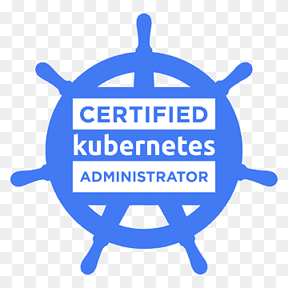

# CKA
This repo contains my path towards the CKA; that will take place in 2025.

I formally invite everyone to follow the same steps toward this objective. 

Each Lesson contains brief explanations of the topic and contains all the commands I've ran when learning it.

Should you happen to find some bug, do not hesitate to report it.

  

    
  

---------------------------------------

### Resources:
- https://github.com/anilitblr/certified-kubernetes-administrator
- https://github.com/sandervanvugt/cka
- https://cloudutsuk.com/posts/certification/cka/cka-pratice-test-1/

### TO DO

- Bookmark:
  - Exam A: https://killer.sh/attendee/df264a28-5063-4d6f-a0dd-24574706967d/content

&nbsp;

More material to check:

https://notes.kodekloud.com/docs/CKA-Certification-Course-Certified-Kubernetes-Administrator/Mock-Exams/Mock-Exam-2-Step-by-Step-Solutions
